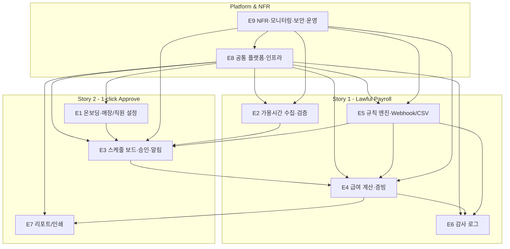

# SaaS Employee Schedule Management – MVP Task Plan v0.1

작성일: 2025-11-18  
기준 문서:  
- `2_GPT/GPT_SRS/GPT-SRS_v0.2.md`  
- `0_DEV_Tools/11_SRS_to_Tasks.md`

---

## 1. MVP Epic 정의 및 REQ 매핑

### 1.1 Epic 목록

- **E1 온보딩·매장/직원 설정**
  - 신규 사장 온보딩, 매장/직원 기본정보 설정, 첫 스케줄 생성 준비.

- **E2 가용시간 수집·검증**
  - 직원 가용시간 제출, 누락/중복 검증, 승인 프로세스 차단 연계.

- **E3 스케줄 보드·승인·알림**
  - 승인 대기 대시보드, 드래그&드롭 편집, 승인, 직원 알림·리마인더.

- **E4 급여 계산·증빙 생성**
  - 급여/수당 계산, 미리보기, 증빙 생성·해시·보관.

- **E5 규칙 엔진·Webhook·CSV 관리**
  - 노동법 규칙 엔진, 고위험 위반 Webhook, 규칙 CSV Import/Export.

- **E6 감사 로그 (Audit Log)**
  - 주요 엔터티 변경 감사 로그, 서명/위변조 탐지 기반.

- **E7 리포트/인쇄용 화면**
  - 인쇄용 레이아웃, 시각적 리포트(스케줄·급여).

- **E8 공통 플랫폼·인프라**
  - 인증/권한, 배포, 공통 로깅/에러 처리, 인프라·보안 기본 설정.

- **E9 NFR·모니터링·보안·운영**
  - 성능, 가용성, 보안, 모니터링·알림, 비용, 확장성, 운영.

---

### 1.2 Epic ↔ Functional Requirements (REQ-FUNC) 매핑

- **E1 온보딩·매장/직원 설정**
  - `REQ-FUNC-001` 3단계 온보딩 마법사  
  - `REQ-FUNC-002` 매장 정보 수집  
  - `REQ-FUNC-003` 직원 등록  

- **E2 가용시간 수집·검증**
  - `REQ-FUNC-004` 공개 가용시간 제출 API  
  - `REQ-FUNC-005` 가용시간 유효성 및 충돌 검증  
  - `REQ-FUNC-018` 입력 오류 감지 및 승인 프로세스 일시 중단  

- **E3 스케줄 보드·승인·알림**
  - `REQ-FUNC-006` 승인 대기 대시보드  
  - `REQ-FUNC-007` 드래그&드롭 스케줄 편집  
  - `REQ-FUNC-008` 1클릭 스케줄 승인  
  - `REQ-FUNC-009` 승인 전 규칙 엔진 평가 (E5 주도, E3 사용)  
  - `REQ-FUNC-010` 위반 시 승인 차단 및 가이드 제공 (E3 & E5)  
  - `REQ-FUNC-016` 직원 스케줄 알림  
  - `REQ-FUNC-017` 직원 리마인더 및 사장님 에스컬레이션  

- **E4 급여 계산·증빙 생성**
  - `REQ-FUNC-011` 자동 급여·수당 계산  
  - `REQ-FUNC-012` 급여 미리보기 및 색상 하이라이트  
  - `REQ-FUNC-013` PDF/엑셀 증빙 생성  
  - `REQ-FUNC-014` 증빙 해시 및 보관  

- **E5 규칙 엔진·Webhook·CSV 관리**
  - `REQ-FUNC-009` 승인 전 규칙 엔진 평가 (주도 Epic)  
  - `REQ-FUNC-010` 위반 시 승인 차단 및 가이드 제공 (엔진 레벨)  
  - `REQ-FUNC-019` 법규 위반 Webhook 통지  
  - `REQ-FUNC-020` CSV 기반 법규 규칙 관리  

- **E6 감사 로그 (Audit Log)**
  - `REQ-FUNC-015` 감사 로그(Audit Log)  

- **E7 리포트/인쇄용 화면**
  - `REQ-FUNC-012` 급여 미리보기 및 색상 하이라이트 (UI 관점)  
  - `REQ-FUNC-021` 인쇄용 리포트  

- **E8 공통 플랫폼·인프라**
  - 직접적인 REQ-FUNC는 적지만, 인증/권한, 공통 로깅, 배포·운영 인프라를 담당.

- **E9 NFR·모니터링·보안·운영**
  - 기능 REQ-FUNC는 없고, REQ-NF 기반 Epic.

---

### 1.3 Epic ↔ Non-Functional Requirements (REQ-NF) 주요 매핑

- **성능**
  - `REQ-NF-001` 스케줄 보드 조회 p95 ≤ 0.8s → E3  
  - `REQ-NF-002` 승인 처리 p95 ≤ 1.2s → E3  
  - `REQ-NF-003` PDF 생성 시간 ≤ 5s → E4  

- **신뢰성**
  - `REQ-NF-004` 서비스 가용성 99.5% 이상 → E9  
  - `REQ-NF-005` 규칙 엔진 오류율 ≤ 0.2% → E5, E3  
  - `REQ-NF-006` 알림 전송 성공률 ≥ 97% → E3  

- **보안·데이터**
  - `REQ-NF-007` 저장 데이터 암호화 → E8/E9, 영향: E1/E2/E4/E6  
  - `REQ-NF-008` 전송 구간 암호화(TLS 1.3) → E8/E9, 모든 API  
  - `REQ-NF-009` 데이터 국외 반출 금지 → E8/E9  
  - `REQ-NF-010` PII 최소 수집(8개 이하) → E1/E2/E3/E4  

- **접근 제어·운영**
  - `REQ-NF-011` 관리자·규칙 관리 접근 제어 → E5, E8  
  - `REQ-NF-012` 매장당 월 운영 비용 ≤ 3,000원 → E9  
  - `REQ-NF-013` 모니터링 범위 → E8/E9  
  - `REQ-NF-014` 알림 임계값 → E8/E9  
  - `REQ-NF-015` 매장 수 확장성(60개) → E9  
  - `REQ-NF-016` 규칙 변경 리드타임 2주 이내 → E5/E9  
  - `REQ-NF-017` 핫픽스 가능성 → E8/E9  

---

## 2. Epic별 Capability 클러스터링

### 2.1 E1 온보딩·매장/직원 설정

- **Capability: 온보딩 플로우 실행**
  - REQ: `REQ-FUNC-001`, `REQ-FUNC-002`, `REQ-FUNC-003`
- **Capability: 매장/직원 마스터 관리 (CRUD)**
  - REQ: `REQ-FUNC-002`, `REQ-FUNC-003`

### 2.2 E2 가용시간 수집·검증

- **Capability: 가용시간 제출**
  - REQ: `REQ-FUNC-004`
- **Capability: 가용시간 검증·충돌 처리 및 승인 차단 연계**
  - REQ: `REQ-FUNC-005`, `REQ-FUNC-018`

### 2.3 E3 스케줄 보드·승인·알림

- **Capability: 승인 대기 카드/보드 조회**
  - REQ: `REQ-FUNC-006`
- **Capability: 스케줄 편집(DnD) 및 Draft 버전 관리**
  - REQ: `REQ-FUNC-007`
- **Capability: 1-click 승인 및 상태 전이**
  - REQ: `REQ-FUNC-008`, `REQ-FUNC-009`, `REQ-FUNC-010`
- **Capability: 직원 알림 및 리마인더/에스컬레이션**
  - REQ: `REQ-FUNC-016`, `REQ-FUNC-017`

### 2.4 E4 급여 계산·증빙 생성

- **Capability: 급여 계산 및 미리보기**
  - REQ: `REQ-FUNC-011`, `REQ-FUNC-012`
- **Capability: 증빙 생성·다운로드·보관**
  - REQ: `REQ-FUNC-013`, `REQ-FUNC-014`

### 2.5 E5 규칙 엔진·Webhook·CSV 관리

- **Capability: 스케줄 규칙 평가**
  - REQ: `REQ-FUNC-009`, `REQ-FUNC-010`
- **Capability: 고위험 위반 Webhook 통지**
  - REQ: `REQ-FUNC-019`
- **Capability: 규칙 CSV Import/Export**
  - REQ: `REQ-FUNC-020`

### 2.6 E6 감사 로그

- **Capability: 감사 로그 기록 및 조회**
  - REQ: `REQ-FUNC-015`

### 2.7 E7 리포트/인쇄용 화면

- **Capability: 급여 미리보기 리포트 UI**
  - REQ: `REQ-FUNC-012`
- **Capability: 인쇄용 스케줄/급여 리포트**
  - REQ: `REQ-FUNC-021`

### 2.8 E8 공통 플랫폼·인프라

- **Capability: 인증/권한 및 관리자 접근 제어**
  - REQ-NF-011 등과 규칙 관리/관리자 콘솔 연계.
- **Capability: 공통 로깅/에러 처리**
- **Capability: 배포·릴리즈 파이프라인/핫픽스**

### 2.9 E9 NFR·모니터링·보안·운영

- **Capability: 성능·가용성 관리**
- **Capability: 보안·데이터 보호**
- **Capability: 모니터링·알림·비용/확장성 관리**

---

## 3. REQ → Behavior 기반 Sub-Task 분해 (핵심 요약)

### 3.1 E2 가용시간 수집·검증

- **REQ-FUNC-004 공개 가용시간 제출 API**
  - Input: 요청 DTO 설계, 모바일 폼→서버 매핑.
  - Process: 토큰/주차 검증, timeRanges 파싱, 기존 제출 처리 정책.
  - Output: 제출 ID/요약, 검증 에러 구조.
  - Exception: 401/403/400/429 처리 전략.
  - Configuration: Rate Limit, 제출 기간 설정.
  - Test: 정상/에러/Rate Limit/토큰 오류 API·통합 테스트.

- **REQ-FUNC-005 가용시간 유효성 및 충돌 검증**
  - Input: 기존 timeRanges 조회.
  - Process: 중복/겹침/영업시간 범위 검증 알고리즘.
  - Output: 에러 코드+위치 정보 구조.
  - Configuration: 최소 블록 단위, 허용 시간대.
  - Test: 다양한 겹침 케이스 유닛·통합 테스트.

- **REQ-FUNC-018 입력 오류 감지 및 승인 프로세스 일시 중단**
  - Process: 오류 상태 플래그, 승인 차단 플로우.
  - Output: 수정 요청 알림, 대시보드 상태 표시.
  - Configuration: 30분 이내 알림 SLA.
  - Test: 오류 발생 후 알림·승인 차단 E2E 테스트.

### 3.2 E3 스케줄 보드·승인·알림

- **REQ-FUNC-006 승인 대기 대시보드**
  - Process: 가용시간 제출 비율 계산, 3단계 카드 모델.
  - Output: 승인 대기 카드 DTO.
  - Test: 70% 기준 및 p95 성능 테스트.

- **REQ-FUNC-007 드래그&드롭 스케줄 편집**
  - Process: Draft 버전 생성/업데이트, Delta 계산.
  - Exception: 영업시간 범위 밖 편집 롤백.
  - Test: Draft 저장/재조회 UI/E2E 테스트.

- **REQ-FUNC-008 1클릭 스케줄 승인**
  - Process: 상태 전이(Draft→Approved), 승인자/시각 기록, 중복 승인 방지.
  - Exception: 위반 시 409, 이미 승인된 스케줄 처리.
  - Test: 정상/중복/위반 시나리오 테스트.

- **REQ-FUNC-009/010 규칙 엔진 평가 + 위반 차단**
  - E5에서 엔진 상세 구현, E3에서는 호출·결과 처리/버튼 비활성화/가이드 표시.

- **REQ-FUNC-016 직원 스케줄 알림**
  - Process: 채널 결정, 메시지 포맷, 게이트웨이 호출.
  - Configuration: 15초 이내 발송 SLA, 재시도 정책.
  - Test: 게이트웨이 모킹 통합 테스트.

- **REQ-FUNC-017 직원 리마인더 및 사장님 에스컬레이션**
  - Process: 12시간 경과 체크, 미확인 비율 계산, 임계값 10%.
  - Test: 시간 경과 시나리오 시뮬레이션 테스트.

### 3.3 E4, E1, E5, E6, E7

E4(급여 계산·증빙), E1(온보딩·Store/Employee), E5(규칙 엔진·Webhook·CSV), E6(AuditLog), E7(인쇄용 리포트)도 동일한 패턴으로 Input/Process/Output/Exception/Configuration/Test 관점으로 Sub-Task를 정의한다.

---

## 4. API / 데이터 모델 / Migration Task 매핑

### 4.1 API 목록과 Epic 매핑

- API-01 `POST /api/v1/availability` → E2  
- API-02 `GET /api/v1/schedules/{id}` → E3  
- API-03 `POST /api/v1/schedules/{id}/approve` → E3 (E5/E4/E6/E3 연계)  
- API-04 `GET /api/v1/reports/payroll` → E4  
- API-05 `POST /events/violation` → E5  
- API-06 `POST /admin/rules/import` → E5  
- API-07 `GET /admin/rules/export` → E5  

### 4.2 주요 API별 구현 Task (예시)

- API-01: DTO, Controller, Service, Validator, 테스트.
- API-02/03: 스케줄 조회·승인 Controller/Service, 상태 전이/엔진 호출/알림 연계.
- API-04: 급여/증빙 조회 Controller/Service, PayrollRecord/EvidenceFile 연계.
- API-05~07: Webhook 클라이언트, CSV Import/Export Controller/Service.

### 4.3 주요 엔터티 및 DB Task

- `Store`, `Employee`, `AvailabilitySubmission`, `Schedule`, `ComplianceRule`, `AuditLog`, `PayrollRecord`, `EvidenceFile` 등:
  - 테이블 설계, Migration 스크립트, JPA Entity/Repository, 인덱스·제약조건 설계, 테스트 데이터 스크립트.

---

## 5. REQ-NF → DevOps/QA/Monitoring Task

### 5.1 성능 (REQ-NF-001~003)

- 스케줄 보드/승인/문서 생성 API에 대한 k6 부하 테스트 작성.
- 인덱스·캐싱·비동기 처리 설계 및 튜닝.
- APM 대시보드에서 p95 응답 시간 메트릭 구성·알림 설정.

### 5.2 신뢰성 (REQ-NF-004~006)

- 헬스체크/업타임 모니터링, 배포 전략(롤링/블루-그린).
- 규칙 엔진 재시도·Fail-safe 전략 구현, 알림 성공률 모니터링·재시도 큐 구성.

### 5.3 보안 (REQ-NF-007~011)

- PII 식별 및 컬럼 암호화, 키 관리(KMS).
- TLS 1.3, HTTP→HTTPS 리다이렉트/차단, SSL 스캔.
- 데이터 위치 리포트, PII 최소 수집 검증, 관리자·규칙 관리 접근 제어(MFA 포함).

### 5.4 비용·모니터링·운영·확장성 (REQ-NF-012~017)

- 비용 태깅·리포트, 핵심 메트릭 정의·대시보드, SLA/Alert 룰.
- 60개 가상 매장 부하 테스트 및 확장 전략.
- 규칙 변경 워크플로우·리드타임 측정, 핫픽스 배포·롤백 시나리오 테스트.

---

## 6. 글로벌 Task Tree 및 의존 그래프

### 6.1 상위 Task Tree 구조 (개요)

- **Story 1 – Lawful Payroll**
  - E2 가용시간 수집·검증
    - Capability: 가용시간 제출 (`REQ-FUNC-004`)
    - Capability: 가용시간 검증/승인 차단 (`REQ-FUNC-005`, `REQ-FUNC-018`)
  - E5 규칙 엔진·Webhook·CSV
  - E4 급여 계산·증빙
  - E6 감사 로그

- **Story 2 – 1-click Approve**
  - E1 온보딩·매장/직원 설정
  - E3 스케줄 보드·승인·알림
  - E7 리포트/인쇄

- **공통**
  - E8 공통 플랫폼·인프라
  - E9 NFR·모니터링·보안·운영

### 6.2 상위 의존 관계 그래프 (Mermaid)

- 대략적 구현 순서:
  - 1차: E1, E2, E8 (기초 데이터 + 가용시간 + 플랫폼)
  - 2차: E5 (규칙 엔진·관리)
  - 3차: E3 (스케줄 보드·승인·알림)
  - 4차: E4, E6 (급여·증빙·감사 로그)
  - 5차: E7, E9 (리포트·NFR 튜닝/운영)

---

## 7. 활용 방법

- 이 문서의 구조(Story → Epic → Capability → REQ → Task)를 Jira/Linear/Notion 등의 백로그 구조로 그대로 이식할 수 있다.
- 각 Task에 REQ ID, Story ID, Epic ID를 태깅하면, SRS와 구현/테스트 간 추적성을 유지하면서 MVP 개발을 진행할 수 있다.

