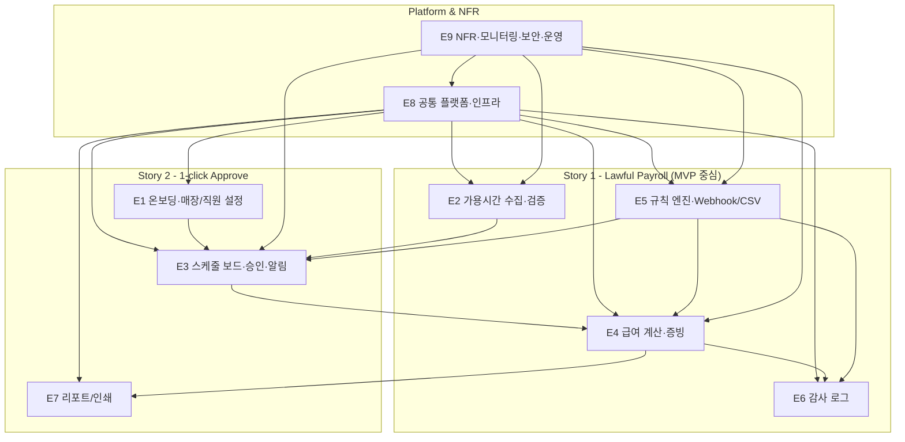

## 1. MVP Epic 정의 및 REQ 매핑

### 1.1 Epic 목록

* **E1 온보딩·매장/직원 설정**
  * 신규 사장 온보딩, 매장/직원 기본정보 설정, 첫 스케줄 생성 준비.
  * **MVP 범위** : 기본 3단계 온보딩, 매장/직원 CRUD, 고급 UX/애니메이션은 제외.
* **E2 가용시간 수집·검증**
  * 직원 가용시간 제출, 누락/중복 검증, 승인 프로세스 차단 연계.
  * **MVP 범위** : 공개 가용시간 제출, 중복/겹침/영업시간 초과 정도의 기본 검증, 오류 시 승인 차단.
  * Rate Limit, 제출 기간 동적 설정 UI 등은 **서버 고정값 + 환경 변수**로 시작.
* **E3 스케줄 보드·승인·알림**
  * 승인 대기 대시보드, 스케줄 편집, 승인, 직원 알림·리마인더.
  * **MVP 범위** :
  * 승인 대기 대시보드(카드/리스트 기반)
  * 단순 테이블/폼 기반 스케줄 편집 (추후 드래그&드롭 보드는 Post-MVP)
  * 1클릭 스케줄 승인 + 규칙 엔진 동기 평가
  * 승인 시 1회 직원 알림
  * **Post-MVP** : DnD 보드, 자동 리마인더/에스컬레이션, 복잡한 버튼 상태/가이드 UI.
* **E4 급여 계산·증빙 생성**
  * 급여/수당 계산, 미리보기, 증빙 생성·보관.
  * **MVP 범위** :
  * 자동 급여·수당 계산, HTML 기반 미리보기
  * 증빙 생성(HTML/CSV 또는 PDF 중 1종) + DB/S3 저장
  * **Post-MVP** :
  * PDF와 Excel 동시 지원,
  * 증빙 해시 체인/전자서명 기반 위변조 탐지.
* **E5 규칙 엔진·Webhook·CSV 관리**
  * 노동법 규칙 엔진, 고위험 위반 Webhook, 규칙 CSV Import/Export.
  * **MVP 범위** :
  * 코드+DB 파라미터 기반의 **간단 규칙 엔진 v0** (if-else + 파라미터 테이블)
  * **Post-MVP** :
  * 고위험 위반 Webhook, CSV 기반 규칙 Import/Export,
  * 범용 Rule Engine(Drools 등) 도입 가능성 검토.
* **E6 감사 로그 (Audit Log)**
  * 주요 엔터티 변경 감사 로그.
  * **MVP 범위** :
  * Append-Only AuditLog 테이블, CreatedAt/Actor/BeforeAfter JSON 정도의 단순 기록.
  * **Post-MVP** :
  * 변경 이력 해시 체인, 전자서명 기반 위변조 탐지.
* **E7 리포트/인쇄용 화면**
  * 인쇄용 레이아웃, 리포트(스케줄·급여).
  * **MVP 범위** :
  * 브라우저 인쇄용 CSS(print-friendly HTML) 기반 레이아웃,
  * 간단 테이블 리포트(그래프/고급 시각화 제외).
  * **Post-MVP** :
  * 그래프/차트 중심의 시각적 리포트, 복잡한 레이아웃 템플릿.
* **E8 공통 플랫폼·인프라**
  * 인증/권한, 배포, 공통 로깅/에러 처리, 인프라·보안 기본 설정.
  * **MVP 범위** :
  * 단일 모놀리식 백엔드(Spring Boot) + 단일 프론트엔드(React/TS) + 단일 RDB(PostgreSQL)
  * 기본 인증/권한(사장/직원), 공통 로깅, 에러 처리, HTTPS Termination
  * 단순 롤링/단일 환경 배포 (블루-그린/K8s는 Post-MVP).
* **E9 NFR·모니터링·보안·운영**
  * 성능, 가용성, 보안, 모니터링·알림, 비용, 확장성, 운영.
  * **MVP 범위** :
  * CloudWatch + Spring Actuator 기반 기본 헬스체크/메트릭
  * 60개 매장 기준 성능/비용 목표의 기본 검증
  * TLS, PII 최소 수집, 간단 컬럼 암호화 (KMS는 키 보관 중심).
  * **Post-MVP** :
  * 고급 APM SaaS, 복잡한 SLA/Alert 룰, 정교한 비용 태깅/리포트 자동화.

---

### 1.2 Epic ↔ Functional Requirements (REQ-FUNC) 매핑

* **E1 온보딩·매장/직원 설정**
  * `REQ-FUNC-001` 3단계 온보딩 마법사 (MVP: 단순 단계형 폼, 고급 UX는 Post-MVP)
  * `REQ-FUNC-002` 매장 정보 수집
  * `REQ-FUNC-003` 직원 등록
* **E2 가용시간 수집·검증**
  * `REQ-FUNC-004` 공개 가용시간 제출 API
  * `REQ-FUNC-005` 가용시간 유효성 및 충돌 검증
    * MVP: 중복/겹침/영업시간 범위 검증 중심
    * Post-MVP: 세부 노동법 규정 반영 강화
  * `REQ-FUNC-018` 입력 오류 감지 및 승인 프로세스 일시 중단
* **E3 스케줄 보드·승인·알림**
  * `REQ-FUNC-006` 승인 대기 대시보드
  * `REQ-FUNC-007` 스케줄 편집
    * **MVP** : 테이블/폼 기반 편집 UI
    * **Post-MVP** : 드래그&드롭 스케줄 보드
  * `REQ-FUNC-008` 1클릭 스케줄 승인
  * `REQ-FUNC-009` 승인 전 규칙 엔진 평가 (E5 주도, E3 사용)
  * `REQ-FUNC-010` 위반 시 승인 차단 및 가이드 제공 (E3 & E5, MVP에서는 단순 메시지 위주)
  * `REQ-FUNC-016` 직원 스케줄 알림
    * MVP: 승인 시 1회 알림(이메일/카카오 등 단일 채널)
    * Post-MVP: 채널 다각화 및 세분화
  * `REQ-FUNC-017` 직원 리마인더 및 사장님 에스컬레이션
    * 주로 **Post-MVP** 기능으로 취급 (MVP에선 최소/수동 리마인더로 시작 가능)
* **E4 급여 계산·증빙 생성**
  * `REQ-FUNC-011` 자동 급여·수당 계산
  * `REQ-FUNC-012` 급여 미리보기 및 색상 하이라이트
  * `REQ-FUNC-013` 증빙 생성
    * **MVP** : HTML/CSV 또는 PDF 중 한 가지 형식 제공
    * **Post-MVP** : PDF + Excel 동시 지원 및 템플릿 고도화
  * `REQ-FUNC-014` 증빙 보관
    * **MVP** : DB 레코드 + S3 저장
    * **Post-MVP** : 해시 기반 위변조 탐지 및 서명 체계
* **E5 규칙 엔진·Webhook·CSV 관리**
  * `REQ-FUNC-009` 승인 전 규칙 엔진 평가 (주도 Epic)
  * `REQ-FUNC-010` 위반 시 승인 차단 및 가이드 제공 (엔진 레벨)
    * **MVP** : 코드 기반 규칙 엔진 v0 + 간단 가이드 메시지
    * **Post-MVP** : 규칙 템플릿/상세 사유 UI 고도화
  * `REQ-FUNC-019` 법규 위반 Webhook 통지 ( **주요 Post-MVP 항목** )
  * `REQ-FUNC-020` CSV 기반 법규 규칙 관리 ( **주요 Post-MVP 항목** )
* **E6 감사 로그 (Audit Log)**
  * `REQ-FUNC-015` 감사 로그(Audit Log)
    * **MVP** : 주요 엔터티 변경에 대한 Append-Only 로그
    * **Post-MVP** : 해시 체인/전자서명 기반 위변조 탐지
* **E7 리포트/인쇄용 화면**
  * `REQ-FUNC-012` 급여 미리보기 및 색상 하이라이트 (UI 관점)
  * `REQ-FUNC-021` 인쇄용 리포트
    * **MVP** : CSS print 스타일을 적용한 HTML 인쇄용 레이아웃
    * **Post-MVP** : 그래프/차트 포함 시각적 리포트
* **E8 공통 플랫폼·인프라**
  * 직접적인 REQ-FUNC는 적지만, 인증/권한, 공통 로깅, 배포·운영 인프라를 담당.
  * **MVP** : 모놀리식 Spring Boot + React + PostgreSQL + 기본 CI/CD 파이프라인.
* **E9 NFR·모니터링·보안·운영**
  * 기능 REQ-FUNC는 없고, REQ-NF 기반 Epic.
  * **MVP** : CloudWatch/Actuator 기반 모니터링, 단일 리전/단일 환경 운영.

---

### 1.3 Epic ↔ Non-Functional Requirements (REQ-NF) 주요 매핑

* **성능**
  * `REQ-NF-001` 스케줄 보드 조회 p95 ≤ 0.8s → E3
  * `REQ-NF-002` 승인 처리 p95 ≤ 1.2s → E3
  * `REQ-NF-003` PDF(또는 문서) 생성 시간 ≤ 5s → E4
    * MVP에서 PDF 대신 HTML/CSV를 선택하는 경우에도 동일 목표 적용.
* **신뢰성**
  * `REQ-NF-004` 서비스 가용성 99.5% 이상 → E9
  * `REQ-NF-005` 규칙 엔진 오류율 ≤ 0.2% → E5, E3
    * MVP: 코드 기반 엔진 v0에 대한 기본 모니터링/알림
  * `REQ-NF-006` 알림 전송 성공률 ≥ 97% → E3
* **보안·데이터**
  * `REQ-NF-007` 저장 데이터 암호화 → E8/E9, 영향: E1/E2/E4/E6
    * MVP: 핵심 PII 컬럼에 대한 애플리케이션 레벨 암호화 + KMS/SSM을 통한 키 보관
  * `REQ-NF-008` 전송 구간 암호화(TLS 1.3) → E8/E9, 모든 API
  * `REQ-NF-009` 데이터 국외 반출 금지 → E8/E9
  * `REQ-NF-010` PII 최소 수집(8개 이하) → E1/E2/E3/E4
* **접근 제어·운영**
  * `REQ-NF-011` 관리자·규칙 관리 접근 제어 → E5, E8
  * `REQ-NF-012` 매장당 월 운영 비용 ≤ 3,000원 → E9
  * `REQ-NF-013` 모니터링 범위 → E8/E9
  * `REQ-NF-014` 알림 임계값 → E8/E9
  * `REQ-NF-015` 매장 수 확장성(60개) → E9
  * `REQ-NF-016` 규칙 변경 리드타임 2주 이내 → E5/E9
  * `REQ-NF-017` 핫픽스 가능성 → E8/E9

---

### 1.4 MVP 스코프 요약 (기능/파)

* **MVP 필수 REQ-FUNC (v1.0)**
  * 온보딩/기본 데이터: `REQ-FUNC-001`, `002`, `003`
  * 가용시간: `004`, `005`, `018`
  * 스케줄/승인: `006`, `007(폼 기반)`, `008`, `009`, `010`, `016(1회 알림)`
  * 급여/증빙: `011`, `012`, `013(단일 형식)`, `014(DB+S3 보관)`
  * 감사 로그: `015`(단순 Append-Only)
  * 인쇄/리포트: `021`(HTML 인쇄용)
* **주요 Post-MVP 후보 (v1.x 이후)**
  * E3 DnD 보드 UI, 자동 리마인더/에스컬레이션(`017`)
  * E4 PDF+Excel 동시 지원, 해시 체인/전자서명(`014` 고도화)
  * E5 Webhook(`019`), CSV 규칙 관리(`020`), 범용 Rule Engine 도입
  * E6 해시 체인/전자서명, E7 그래프/차트 시각화 리포트
  * E8/E9의 고급 DevOps (블루-그린, K8s, 상용 APM, 복잡한 Alert 규칙 등)

---

## 2. Epic별 Capability 클러스터링

### 2.1 E1 온보딩·매장/직원 설정

* **Capability: 온보딩 플로우 실행**
  * REQ: `REQ-FUNC-001`, `REQ-FUNC-002`, `REQ-FUNC-003`
* **Capability: 매장/직원 마스터 관리 (CRUD)**
  * REQ: `REQ-FUNC-002`, `REQ-FUNC-003`

### 2.2 E2 가용시간 수집·검증

* **Capability: 가용시간 제출**
  * REQ: `REQ-FUNC-004`
* **Capability: 가용시간 검증·충돌 처리 및 승인 차단 연계**
  * REQ: `REQ-FUNC-005`, `REQ-FUNC-018`

### 2.3 E3 스케줄 보드·승인·알림

* **Capability: 승인 대기 카드/보드 조회**
  * REQ: `REQ-FUNC-006`
* **Capability: 스케줄 편집 및 Draft 버전 관리**
  * REQ: `REQ-FUNC-007`
  * MVP: 테이블/폼 기반 편집 + Draft 저장/재조회
  * Post-MVP: 드래그&드롭 보드
* **Capability: 1-click 승인 및 상태 전이**
  * REQ: `REQ-FUNC-008`, `REQ-FUNC-009`, `REQ-FUNC-010`
* **Capability: 직원 알림 및 리마인더/에스컬레이션**
  * REQ: `REQ-FUNC-016`, `REQ-FUNC-017`
  * MVP: 승인 시 1회 알림 중심, 자동 리마인더/에스컬레이션은 Post-MVP

### 2.4 E4 급여 계산·증빙 생성

* **Capability: 급여 계산 및 미리보기**
  * REQ: `REQ-FUNC-011`, `REQ-FUNC-012`
* **Capability: 증빙 생성·다운로드·보관**
  * REQ: `REQ-FUNC-013`, `REQ-FUNC-014`
  * MVP: 단일 형식(HTML/CSV/PDF 중 택1) + DB/S3 보관
  * Post-MVP: 복수 형식 + 해시/서명 고도화

### 2.5 E5 규칙 엔진·Webhook·CSV 관리

* **Capability: 스케줄 규칙 평가**
  * REQ: `REQ-FUNC-009`, `REQ-FUNC-010`
  * MVP: 코드 기반 Rule Engine v0 + 파라미터 테이블
* **Capability: 고위험 위반 Webhook 통지**
  * REQ: `REQ-FUNC-019` (주요 Post-MVP)
* **Capability: 규칙 CSV Import/Export**
  * REQ: `REQ-FUNC-020` (주요 Post-MVP)

### 2.6 E6 감사 로그

* **Capability: 감사 로그 기록 및 조회**
  * REQ: `REQ-FUNC-015`

### 2.7 E7 리포트/인쇄용 화면

* **Capability: 급여 미리보기 리포트 UI**
  * REQ: `REQ-FUNC-012`
* **Capability: 인쇄용 스케줄/급여 리포트**
  * REQ: `REQ-FUNC-021`

### 2.8 E8 공통 플랫폼·인프라

* **Capability: 인증/권한 및 관리자 접근 제어**
  * REQ-NF-011 등과 규칙 관리/관리자 콘솔 연계.
* **Capability: 공통 로깅/에러 처리**
* **Capability: 배포·릴리즈 파이프라인/핫픽스**
  * MVP: 단순 CI/CD(빌드→단일 환경 배포), 롤백 수동/스크립트 수준.
  * Post-MVP: 블루-그린, 다중 환경 자동 롤백 등.

### 2.9 E9 NFR·모니터링·보안·운영

* **Capability: 성능·가용성 관리**
* **Capability: 보안·데이터 보호**
* **Capability: 모니터링·알림·비용/확장성 관리**

---

## 3. REQ → Behavior 기반 Sub-Task 분해 (핵심 요약)

### 3.1 E2 가용시간 수집·검증

* **REQ-FUNC-004 공개 가용시간 제출 API**
  * Input: 요청 DTO 설계, 모바일 폼→서버 매핑.
  * Process: 토큰/주차 검증, timeRanges 파싱, 기존 제출 처리 정책.
  * Output: 제출 ID/요약, 검증 에러 구조.
  * Exception: 401/403/400/429 처리 전략.
  * Configuration: Rate Limit, 제출 기간 설정(초기에는 환경 변수/설정값 고정).
  * Test: 정상/에러/Rate Limit/토큰 오류 API·통합 테스트.
* **REQ-FUNC-005 가용시간 유효성 및 충돌 검증**
  * Input: 기존 timeRanges 조회.
  * Process: 중복/겹침/영업시간 범위 검증 알고리즘.
  * Output: 에러 코드+위치 정보 구조.
  * Configuration: 최소 블록 단위, 허용 시간대.
  * Test: 다양한 겹침 케이스 유닛·통합 테스트.
* **REQ-FUNC-018 입력 오류 감지 및 승인 프로세스 일시 중단**
  * Process: 오류 상태 플래그, 승인 차단 플로우.
  * Output: 수정 요청 알림, 대시보드 상태 표시.
  * Configuration: 30분 이내 알림 SLA.
  * Test: 오류 발생 후 알림·승인 차단 E2E 테스트.

### 3.2 E3 스케줄 보드·승인·알림

* **REQ-FUNC-006 승인 대기 대시보드**
  * Process: 가용시간 제출 비율 계산, 3단계 카드 모델.
  * Output: 승인 대기 카드 DTO.
  * Test: 70% 기준 및 p95 성능 테스트.
* **REQ-FUNC-007 스케줄 편집 (MVP: 폼/테이블 기반)**
  * Process: Draft 버전 생성/업데이트, Delta 계산.
  * Exception: 영업시간 범위 밖 편집 롤백.
  * Test: Draft 저장/재조회 UI/E2E 테스트.
  * Post-MVP: 동일 도메인 로직 재사용하여 DnD UI 추가.
* **REQ-FUNC-008 1클릭 스케줄 승인**
  * Process: 상태 전이(Draft→Approved), 승인자/시각 기록, 중복 승인 방지.
  * Exception: 위반 시 409, 이미 승인된 스케줄 처리.
  * Test: 정상/중복/위반 시나리오 테스트.
* **REQ-FUNC-009/010 규칙 엔진 평가 + 위반 차단**
  * E5에서 엔진 상세 구현(코드 기반 Rule Engine v0), E3에서는 호출·결과 처리/버튼 비활성화/가이드 표시.
* **REQ-FUNC-016 직원 스케줄 알림**
  * Process: 채널 결정(초기에는 1개 채널), 메시지 포맷, 게이트웨이 호출.
  * Configuration: 15초 이내 발송 SLA, 재시도 정책(간단 재시도 큐 또는 재시도 로직).
  * Test: 게이트웨이 모킹 통합 테스트.
* **REQ-FUNC-017 직원 리마인더 및 사장님 에스컬레이션 (주요 Post-MVP)**
  * Process: 12시간 경과 체크, 미확인 비율 계산, 임계값 10%.
  * Test: 시간 경과 시나리오 시뮬레이션 테스트.

### 3.3 E4, E1, E5, E6, E7

E4(급여 계산·증빙), E1(온보딩·Store/Employee), E5(규칙 엔진·Webhook·CSV), E6(AuditLog), E7(인쇄용 리포트)도 동일한 패턴으로

Input/Process/Output/Exception/Configuration/Test 관점으로 Sub-Task를 정의한다.

이때 Post-MVP 항목(예: Webhook, CSV Import/Export, DnD, 해시/전자서명 등)은 별도 Tag로 구분하여 백로그 우선순위 관리.

---

## 4. API / 데이터 모델 / Migration Task 매핑

### 4.1 API 목록과 Epic 매핑

* API-01 `POST /api/v1/availability` → E2
* API-02 `GET /api/v1/schedules/{id}` → E3
* API-03 `POST /api/v1/schedules/{id}/approve` → E3 (E5/E4/E6/E3 연계)
* API-04 `GET /api/v1/reports/payroll` → E4
* API-05 `POST /events/violation` → E5 ( **주로 Post-MVP** )
* API-06 `POST /admin/rules/import` → E5 ( **Post-MVP** )
* API-07 `GET /admin/rules/export` → E5 ( **Post-MVP** )

### 4.2 주요 API별 구현 Task (예시)

* API-01: DTO, Controller, Service, Validator, 테스트.
* API-02/03: 스케줄 조회·승인 Controller/Service, 상태 전이/엔진 호출/알림 연계.
* API-04: 급여/증빙 조회 Controller/Service, PayrollRecord/EvidenceFile 연계.
* API-05~07: Webhook 클라이언트, CSV Import/Export Controller/Service (Post-MVP 단계에서 구현).

### 4.3 주요 엔터티 및 DB Task

* `Store`, `Employee`, `AvailabilitySubmission`, `Schedule`, `ComplianceRule`, `AuditLog`, `PayrollRecord`, `EvidenceFile` 등:
  * 테이블 설계, Migration 스크립트, JPA Entity/Repository, 인덱스·제약조건 설계, 테스트 데이터 스크립트.

---

## 5. REQ-NF → DevOps/QA/Monitoring Task

### 5.1 성능 (REQ-NF-001~003)

* 스케줄 보드/승인/문서 생성 API에 대한 k6 부하 테스트 작성(또는 간단 부하 테스트 도구 활용).
* 인덱스·캐싱·비동기 처리 설계 및 튜닝(필요 시 Redis 도입은 Post-MVP).
* APM 대시보드에서 p95 응답 시간 메트릭 구성·알림 설정
  * MVP: Spring Actuator + CloudWatch 메트릭 대시보드
  * Post-MVP: 상용 APM(SaaS) 연동 가능성

### 5.2 신뢰성 (REQ-NF-004~006)

* 헬스체크/업타임 모니터링, 배포 전략(
  * MVP: 롤링/단일 환경 배포,
  * Post-MVP: 블루-그린/다중 환경).
* 규칙 엔진 재시도·Fail-safe 전략 구현, 알림 성공률 모니터링·재시도 큐 구성.

### 5.3 보안 (REQ-NF-007~011)

* PII 식별 및 컬럼 암호화, 키 관리(KMS/SSM Parameter Store).
* TLS 1.3, HTTP→HTTPS 리다이렉트/차단, SSL 스캔.
* 데이터 위치 리포트, PII 최소 수집 검증, 관리자·규칙 관리 접근 제어(MFA 포함 – 필요 시 Post-MVP).

### 5.4 비용·모니터링·운영·확장성 (REQ-NF-012~017)

* 비용 태깅·리포트, 핵심 메트릭 정의·대시보드, SLA/Alert 룰.
* 60개 가상 매장 부하 테스트 및 확장 전략.
* 규칙 변경 워크플로우·리드타임 측정, 핫픽스 배포·롤백 시나리오 테스트.
* **클라우드 비용 가이드 (MVP 목표)** :
* AWS 기준:
  * EC2/Beanstalk: `t4g.small` 1대 수준
  * RDS PostgreSQL: `db.t4g.micro/small` Single-AZ
  * S3 + CloudWatch + SES(이메일)으로 시작
* 총합 약 7~12만 원/월 수준으로 운영,
  * `REQ-NF-012` 매장당 월 3,000원 (60개 매장 기준 18만 원) 목표 내에서 여유 확보.

---

## 6. 글로벌 Task Tree 및 의존 그래프

### 6.1 상위 Task Tree 구조 (개요)

* **Story 1 – Lawful Payroll (MVP 중심)**
  * E2 가용시간 수집·검증
    * Capability: 가용시간 제출 (`REQ-FUNC-004`)
    * Capability: 가용시간 검증/승인 차단 (`REQ-FUNC-005`, `REQ-FUNC-018`)
  * E5 규칙 엔진 (MVP: 코드 기반 Rule Engine v0)
  * E4 급여 계산·증빙 (단일 증빙 형식, DB+S3 보관)
  * E6 감사 로그 (Append-Only 로그)
* **Story 2 – 1-click Approve (MVP + Post-MVP 혼합)**
  * E1 온보딩·매장/직원 설정
  * E3 스케줄 보드·승인·알림
    * MVP: 리스트/폼 기반 + 승인/알림
    * Post-MVP: DnD, 자동 리마인더/에스컬레이션
  * E7 리포트/인쇄
    * MVP: HTML 인쇄용 레이아웃
* **공통**
  * E8 공통 플랫폼·인프라 (모놀리식 + 기본 CI/CD)
  * E9 NFR·모니터링·보안·운영 (CloudWatch/Actuator 중심)

### 6.2 상위 의존 관계 그래프 (Mermaid)

* 대략적 구현 순서:
* 1차: E1, E2, E8 (기초 데이터 + 가용시간 + 플랫폼)
* 2차: E5 (규칙 엔진 v0 중심, Webhook/CSV는 후순위로 Backlog)
* 3차: E3 (스케줄 보드·승인·알림 – MVP UI 기준)
* 4차: E4, E6 (급여·증빙·감사 로그 – 단일 증빙 형식/간단 로그)
* 5차: E7, E9 (리포트·NFR 튜닝/운영 및 Post-MVP 항목 순차 구현)

---

## 7. 활용 방법

* 이 문서의 구조(Story → Epic → Capability → REQ → Task)를 Jira/Linear/Notion 등의 백로그 구조로 그대로 이식할 수 있다.
* 각 Task에 REQ ID, Story ID, Epic ID, **Scope(MVP/Post-MVP)** 태그를 함께 부여하면,
  SRS와 구현/테스트 간 추적성을 유지하면서 MVP 개발을 진행하고, 이후 단계별 고도화를 명확히 관리할 수 있다.
